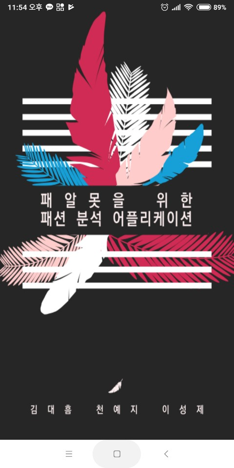
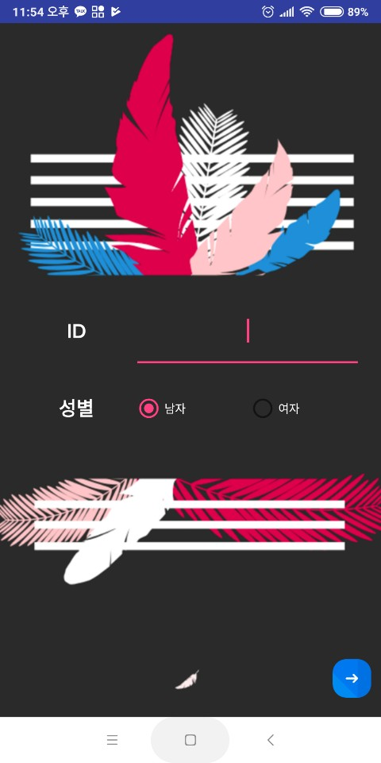
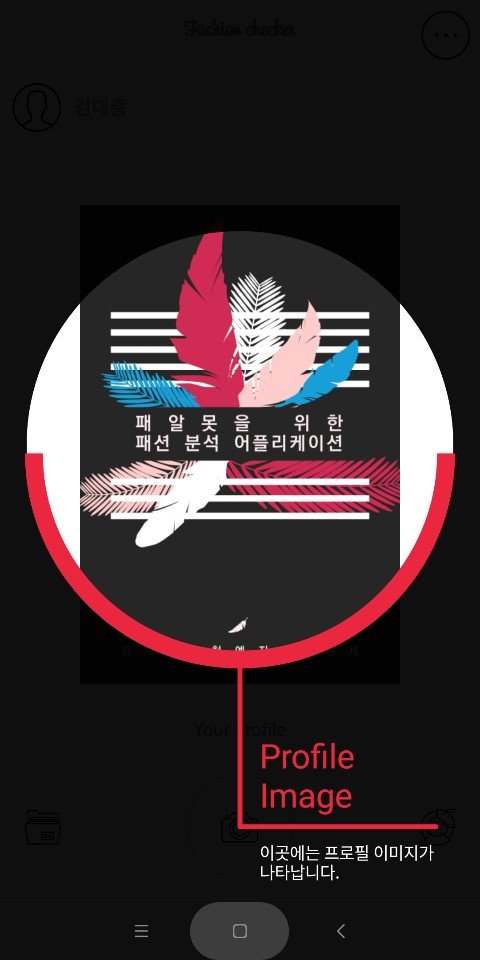
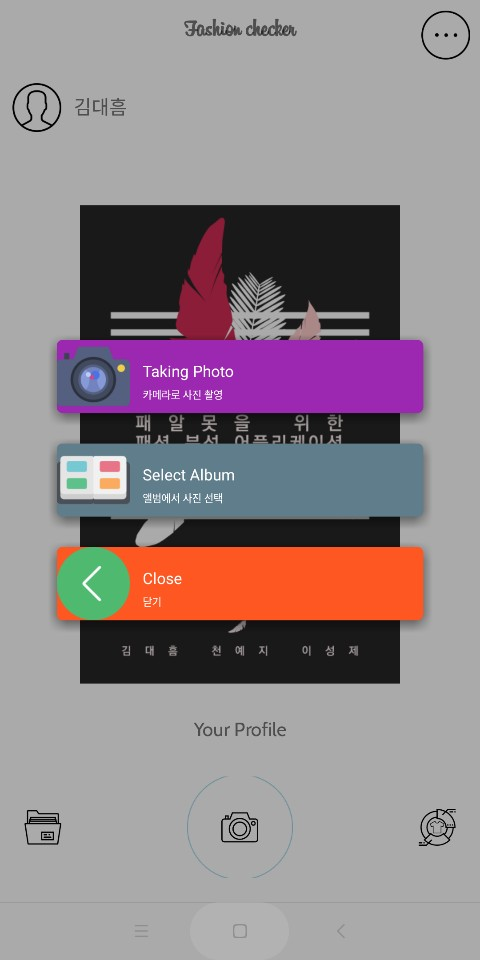
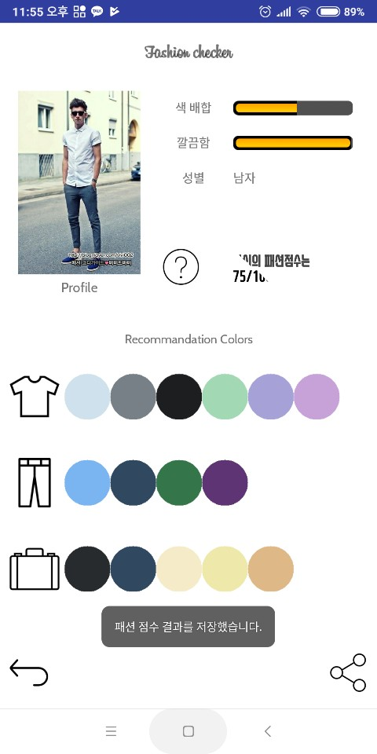
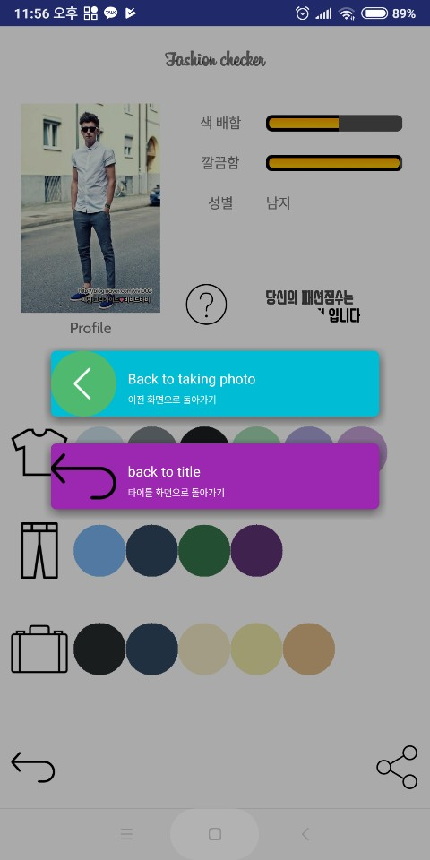

# Fashion Checker
<pre><code>바로바로 사진을 찍어서 자신의 패션에 어울리는 색깔을 확인하자!
색깔 추천 원리에 사용된 개념 : 톤인톤, 톤온톤 
</code></pre>
<pre><code>제작 : 김대흠, 이성제, 천예지</code></pre>
-----------
## ScreenShot
 
 
 
 
 
 
 
 
 
 
